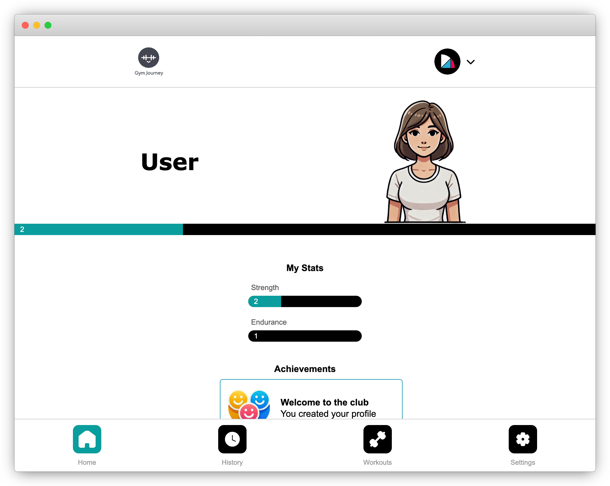

# GymJourmey

GymJourney is a web application that helps you track your gym progress. It allows you to create a workout plan, track your progress, and see your progress over time.

Presentations:

- [Vorstellung der Idee](docs/Vorstellung%20der%20Idee.pdf)
- [Abschlusspräsentation](docs/Abschlusspräsentation.pdf)

# Project Structure

## Directories

The source code is split into three directories.

The `backend` directory contains the backend logic that runs on [Deno](https://deno.com/).

The `frontend` directory contains the code for the frontend clients (running in the web browser).

The default export of the `backend/entrypoint.ts` and `frontend/entrypoint.ts` determine what content
gets displayed when visiting a page in the browser.

The `common` directory contains common modules that can be initialized both in the browser and in the deno backend - they can be imported from modules in the `backend` and `frontend` directory.

The directory names (`backend`, `frontend`, `common`) are important to tell UIX which code runs in which context. The default names can also be changed in the `app.dx` config file.

## app.dx

The `app.dx` configuration file is required for a UIX app to run. It needs to contain at least the app name.
The `app.dx` has to be placed next to the app directories (`frontend`, `backend` and `common`) in the default configuration.

# Cross realm imports

Frontend and common modules can import exported values from backend modules.
In the background, special interface module files are generated, making sure that the backend source code is never exposed to the frontend endpoints.

Access to these exports can be limited by setting DATEX permission filters.

# Development

Compilation of the TS files is not required. The project can be deployed as is.
There is a devcontainer set up, containing the latest deno version.

To run the project, Deno has to be installed:
hit `CTRL`+`F5` to launch the project with the launch configuration.

With the `--live` option, frontend browser tabs are automatically reloaded when a file has changed, which is useful for development, but should not be used in production.

This command starts the backend endpoint and also exposes a web server on port 80 or another available port.

---

&copy; unyt 2024 • [unyt.org](https://unyt.org)
